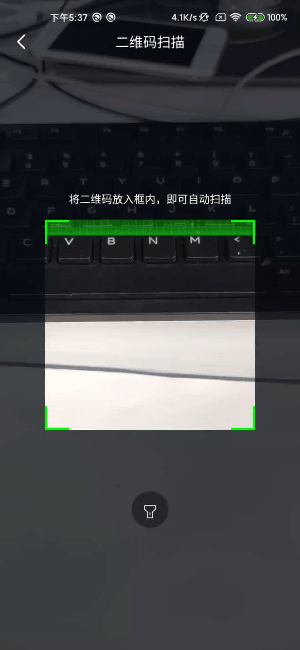

# Androis二维码扫码插件



## 安装

```gradle
implementation 'com.zourw:qrcode-ktx:1.0.1' // kotlin

implementation 'com.zourw:qrcode-java:1.0.1' // java
```

## 使用

1. 使用Activity

    ```kotlin
    // kotlin调用

    Intent(this, QRCodeActivity::class.java)
      .putExtra(EXTRA_TITLE, "二维码扫描")
      .putExtra(EXTRA_HINT, "将二维码放入框内，即可自动扫描")
      .also {
          startActivityForResult(it, REQUEST_CODE)
      }

    override fun onActivityResult(requestCode: Int, resultCode: Int, data: Intent?) {
        super.onActivityResult(requestCode, resultCode, data)
        if (requestCode == REQUEST_CODE) {
            when (resultCode) {
                Activity.RESULT_OK -> tvResult.append("${data?.getStringExtra(EXTRA_RESULT)}\n\n")
                Activity.RESULT_CANCELED -> tvResult.append("取消\n\n")
            }
        }
    }
    ```

    ```java
    // java调用

    final Intent intent = new Intent(MainActivity2.this, QRCodeActivity.class);
    intent.putExtra(QRCodeActivity.EXTRA_TITLE, "二维码扫描");
    intent.putExtra(QRCodeActivity.EXTRA_HINT, "将二维码放入框内，即可自动扫描");
    startActivityForResult(intent, REQUEST_CODE);

    @Override
    protected void onActivityResult(int requestCode, int resultCode, @Nullable Intent data) {
        super.onActivityResult(requestCode, resultCode, data);
        if (requestCode == REQUEST_CODE) {
            switch (resultCode) {
                case RESULT_OK:
                    if (data != null) {
                        tvResult.append(data.getStringExtra(QRCodeActivity.EXTRA_RESULT) + "\n\n");
                    }
                    break;
                case RESULT_CANCELED:
                    tvResult.append("取消\n\n");
                    break;
            }
        }
    }
    ```

2. 使用QRCodeView

    ```xml
    // kotlin
    <com.zourw.libqrcode_ktx.QRCodeView
        android:id="@+id/qrCodeView"
        android:layout_width="match_parent"
        android:layout_height="match_parent"
        app:qr_cornerBreadth="3dp"
        app:qr_cornerColor="#00ff00"
        app:qr_cornerLength="30dp"
        app:qr_gridColor="#00ff00"
        app:qr_gridColumnCount="30"
        app:qr_gridRowCount="30"
        app:qr_offsetXRatio="0.5"
        app:qr_offsetYRatio="0.5"
        app:qr_sizeRatio="0.7" />

    // java
    <com.zourw.libqrcode_java.QRCodeView
        android:id="@+id/qrCodeView"
        android:layout_width="match_parent"
        android:layout_height="match_parent"
        app:qr_cornerBreadth="3dp"
        app:qr_cornerColor="#03A9F4"
        app:qr_cornerLength="30dp"
        app:qr_gridColor="#03A9F4"
        app:qr_gridColumnCount="30"
        app:qr_gridRowCount="30"
        app:qr_offsetXRatio="0.5"
        app:qr_offsetYRatio="0.5"
        app:qr_sizeRatio="0.7" />
    ```

参数|类型|说明
---|---|---
qr_cornerBreadth|dimension|扫描框折角宽度
qr_cornerColor|color|扫描框折角颜色
qr_cornerLength|dimension|扫描框折角长度
qr_gridColor|color|扫描框颜色
qr_gridColumnCount|int|扫描框格子列数
qr_gridRowCount|int|扫描框格子行数
qr_offsetXRatio|float|扫描框中心点相对于宽度的横向偏移
qr_offsetYRatio|float|扫描框中心点相对于高度的纵向偏移
qr_sizeRatio|float|扫描框相对于max(width, height)的比例
